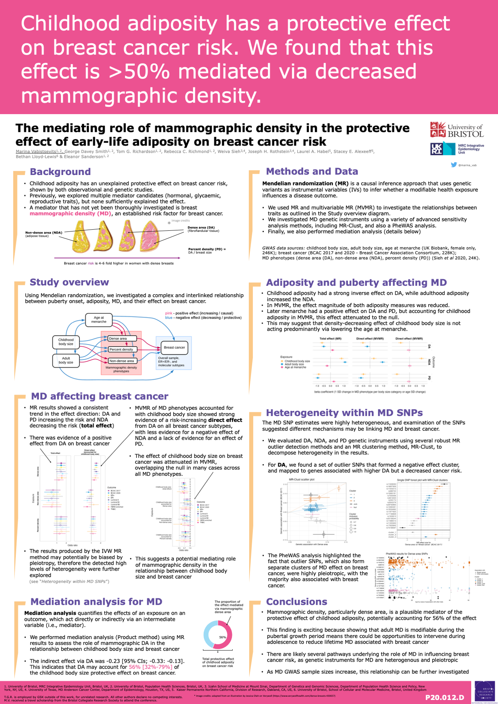

## The mediating role of mammographic density in the protective effect of early-life adiposity on breast cancer risk


This repository contains code and materials from a research project done as a part of PhD programme at the University of Bristol, MRC-IEU.

Pre-print: [https://www.medrxiv.org/content/10.1101/2023.09.01.23294765v1](https://www.medrxiv.org/content/10.1101/2023.09.01.23294765v1)


 **This README contains:**

- project abstract
- poster about this research project 
- outline of the project work/code stored in this repo


### Abstract 


Observational studies suggest that mammographic density (MD) may have a role in the unexplained protective effect of childhood adiposity on breast cancer risk. Here, we investigated a complex and interlinked relationship between puberty onset, adiposity, MD, and their effect on breast cancer using Mendelian randomization (MR).

We estimated the effects of childhood and adulthood adiposity, and age at menarche on MD phenotypes (dense area (DA), non-dense area (NDA), percent density (PD)) using MR and multivariable MR (MVMR), allowing us to disentangle their total and direct effects. Next, we examined the effect of MD on breast cancer outcomes, including molecular subtypes and accounting for genetic pleiotropy. Finally, we used MVMR to evaluate whether the protective effect of childhood adiposity on breast cancer was mediated by MD.

Childhood adiposity had a strong inverse effect on mammographic DA, while adulthood adiposity increased the NDA. Later menarche had a positive effect on DA and PD, but accounting for childhood adiposity, this effect attenuated to the null. DA and PD had a risk-increasing effect on breast cancer across all subtypes. The MD single-nucleotide polymorphism (SNP) estimates were extremely heterogeneous, and examination of the SNPs suggested different mechanisms may be linking MD and breast cancer. Finally, MR mediation analysis estimated that 56% of the childhood adiposity effect was mediated via MD.

In this work, we attempted to disentangle the relationship between factors affecting MD and breast cancer. We showed that childhood adiposity plays a major role in decreasing mammographic dense area, thereby decreasing breast cancer risk, which could highlight opportunities for intervention.

 

### Poster

This poster was presented at the European Society of Human Genetics (ESHG) in 2023.

 
 

### This repository

Main analysis scripts and metadata (see details below):

```
├── set_paths.R
├── 00v1_MD_data_processing.Rmd
├── 00v2_MD_data_processing.Rmd
├── 01_process_gwas_summary.Rmd
├── 02_perform_MR_for_BMI_to_MD.Rmd
├── 03_perform_biMR_and_MVMR_for_X_to_MD.Rmd
├── 04_perform_MR_for_MD_to_BC.Rmd
├── 05_perform_MVMR.Rmd
├── 06_create_forest_plots.Rmd
├── 07_instruments_heterogeneity_review.Rmd
├── 08_gene_pathway_exploration.Rmd
├── functions.R
├── functions_mvmr.R
├── mammo_density_mr.Rproj
├── README.md
├── metadata/
│   ├── data_lookup.csv
│   └── data_lookup_BCAC.csv
├── poster_ESHG.png
├── figures_manuscript/
└── code_supplementary/
```


### How to reproduce this analysis, i.e. Main Workflow


1.  Script `set_paths.R` is imported by all other scripts, and is used to set the environment where the project is run.

2. MD data processing 

	`00v1_MD_data_processing.Rmd` - original MD GWAS files processing (adjusted for BMI)

	`00v2_MD_data_processing.Rmd` - re-run MD GWAS files processing (unadjusted)


3. Processing all other GWAS datasets into a 'tidy' format

	`01_process_gwas_summary.Rmd` is required for processing data that comes as text files (i.e. GWAS summary stats) from the IEU GWAS pipeline or other sources. This script has to be run to convert raw data into `outcome` data frames and to extract instruments from each GWAS (in `exposure` format) and save them to be used directly in MR analysis in subsequent scripts. The names of raw files, tidy outcome data frames, and exposure instruments are all get saved in the metadata file `data_lookup.csv` upon generation. (NB the metadata file has to contain raw file names and the desired output prefixes before running this Rmd).

4. Rmd `02_perform_MR_for_BMI_to_MD.Rmd` runs univariable MR of Childhood and Adult body size on MD (a version of MD data to use is specified via metadata file `data_lookup.csv`). The code has to be run interactively per trait category. The results merged by trait category will be stored in the `Results` directory outside the codebase. 


5. Rmd `03_perform_biMR_and_MVMR_for_X_to_MD.Rmd` runs bidirectional analysis between age at menarche and MD phenotypes, and also MVMR of childhood body size + age at menarche on MD phenotypes (a version of MD data to use is specified via metadata file `data_lookup.csv`).


6. Rmd `04_perform_MR_for_MD_to_BC.Rmd` runs univariable MR of each MD phenotype on breast cancer outcomes (BCAC 2017 form OpenGWAS and BCAC 2020 - local). (A version of MD data to use is specified via metadata file `data_lookup.csv`)

7. Rmd `05_perform_MVMR.Rmd` runs multple MVMR analyses:

	*	 (Analysis 1) childhood BMI + adult BMI -> MD (x3 phenotypes)
	*	 (Analysis 2) childhood BMI + MD (x3 phenotypes separately) -> Breast Cancer (BCAC 2017 x3 and BCAC 2020 x6)


8. Rmd `06_create_forest_plots.Rmd` creates forest plots from all MR and MVMR analyses. The plots are saved to `figures_manusript/` within the codebase. 

9. Rmd `07_instruments_heterogeneity_review.Rmd`: in this script, for each MD phenotype, the following sensitivity / outlier MR / additional analyses are performed:
	- standard sensitivity: Q-het, egger intercept, scatter plot, single SNP forest plot, leave one out
	- MR-PRESSO
	- Radial-MR
	- MR-Clust
	- PheWAS using Phenoscanner and OpenGWAS
	
10. Rmd `08_gene_pathway_exploration.Rmd` - we perform SNP to gene mapping and extract pathways for the identified genes


**NB** - mediation calculations performed in this project are available as a Supplementary note in the paper (i.e. there is no separate script for this).


